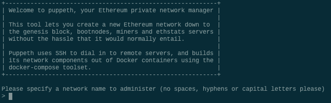

## Proof of Authority Development Chain

The Proof of Authority (PoA) algorithm is typically used for private blockchain networks as it requires pre-approval of, or voting in of, the account addresses that can approve transactions (seal blocks).  

# Creating a Genesis Block

You can create your genesis block using `puppeth`, a tool bundled with the Go Ethereum tool.

The genesis block is the first step towards creating your very own new blockchain!

If you have not yet installed the Go Ethereum tool, or if you have any issues, please refer to the [Installation Guide](blockchain-install-guide.md) for help.

Recall that by **terminal window**, we refer to the `Terminal` in Mac, or `Git Bash` in Windows.

## Instructions

* Open a terminal window, navigate to the `Blockchain-Tools` folder and type the following command:

 ```bash
 ./puppeth
 ```

* This should show the following prompt:

 

* Type in a name for your network, like "puppernet" and hit enter to move forward in the wizard.

* Type `2` to pick the `Configure new genesis` option, then `1` to `Create new genesis from scratch`:

 

Now you have the option to pick a consensus engine (algorithm) to use.

* Type `1` to choose `Proof of Authority` and continue.

You will be asked to enter a pre-fund account.

* Copy and paste an address from your Ethereum wallet in MyCrypto, without the `0x` prefix.

* Once you paste an address and hit enter, hit enter again on the blank `0x` address to continue the prompt.

* Continue with the default option for the prompt that asks `Should the precompile-addresses (0x1 .. 0xff) be pre-funded with 1 wei?` by hitting enter again,
 until you reach the `Chain ID` prompt.

 

* Come up with a number to use as a chain ID (e.g. `333`) type it, then hit enter.

You should see a success message and be redirected to the original prompt:


Awesome! Your genesis configuration is stored in your local home directory.

We'll export this later.

# Creating two nodes with accounts

In this activity, you will create two accounts for nodes to use for mining rewards.

Then, you will initialize the nodes using the genesis block configuration you created earlier to prepare them for bringing the chain to life!

## Instructions

First, export your genesis configuration into a `yournetworkname.json` file as follows:

* In the `puppeth` prompt, navigate to the `Manage existing genesis` by typing `2` and hitting enter.

* You may have to type your network name again first if you're launching `puppeth` fresh.

* Then, type `2` again to choose the `Export genesis configurations` option, and continue with the default (current) directory by hitting enter:

 

* This will export several `yournetworkname.json` files -- we will only be using the first one without `aleth`, `parity`, or `harmony` suffixes.

Now, we need to create at least two nodes to build the chain from the genesis block onward:

* Exit `puppeth` by using the `Ctrl+C` keys combination.

* Create the first node's data directory using the `geth` command and a couple of command line flags by running the following line in your terminal window (Git Bash in Windows):

 ```bash
 ./geth account new --datadir node1
 ```

You should see a success message similar to this one:


* Create a new text file for notes, and copy the node's address into the file and label it `Node 1 Key`.

* Repeat the same process for the second node by replacing the `datadir` parameter with the `node2` folder.

 ```bash
 ./geth account new --datadir node2
 ```

* Make sure to keep track of the node's addresses and which belongs to which. 

Now, it's time to initialize and tell the nodes to use your genesis block!

* Initialize the first node, replacing `yournetworkname.json` with your own:

 ```bash
 ./geth init yournetworkname.json --datadir node1
 ```

You should see this success message:


* Since you only initialize your nodes once, you don't need to copy anything into your notes here.

* Run the same command for `node2`.

 ```bash
 ./geth init yournetworkname.json --datadir node2
 ```

# Bringing the blockchain to life

Now we will start both previously created nodes to bring your blockchain to life.

* `node1` will be a full node that is also mining.

* `node2` will be a full node that exposes an RPC port, allowing you to talk to it with other apps like MyCrypto.

## Instructions

Time to start the blockchain network! Open a terminal window (Git Bash in Windows) navigate to your `Blockchain-Tools` folder and follow the next steps.

In your notes text file, make sure to keep track of **every** command you run in this activity for later. You can use these notes as a cheat-sheet later to easily start your chain again.

* Launch the first node into mining mode with the following command:

 ```bash
 ./geth --datadir node1 --mine --minerthreads 1
 ```

 * The `--mine` flag tells the node to mine new blocks.

 * The `--minerthreads` flag tells `geth` how many CPU threads, or "workers" to use during mining. Since our difficulty is low, we can set it to 1.

You should see the node `Committing new mining work`:


* Copy this command into your notes and label it `Start Node 1`.

Now you will launch the second node and configure it to let us talk to the chain via RPC.

* Scroll up in the terminal window where `node1` is running, and copy the entire `enode://` address (including the last `@address:port` segment) of the first node located in the `Started P2P Networking` line:

 

* We will need this address to tell the second node where to find the first node.

* Open another terminal window and navigate to the same directory as before.

* Launch the second node, enable RPC, change the sync port, and pass the `enode://` address of the first node in quotes by running the following command (it will differ in Windows and OS X):

 * Running in OS X:
 ```bash
 ./geth --datadir node2 --port 30304 --rpc --bootnodes "enode://<replace with node1 enode address>"
 ```

 * Running in Microsoft Windows:
 ```bash
 ./geth --datadir node2 --port 30304 --rpc --bootnodes "enode://<replace with node1 enode address>" --ipcdisable
 ```

* The output of the second node should show information about `Importing block segments` and synchronization:

 

* Copy this command into your notes and call it `Start Node 2`.


# Transacting on your chain

In this activity, you will be connecting MyCrypto to your custom chain, importing your pre-funded wallet, then sending a test transaction to yourself!

## Instructions

First, you will need to get the private key of your pre-funded address and keep it handy for later.

* Open up MyCrypto to get the private key of the ETH address you used to pre-fund your chain. Be sure the `Kovan` network is selected.

 

* Unlock your wallet using your mnemonic phrase and choose the address you want to inspect.

* Select the ETH address you used to pre-fund your chain, and in the "Select" dropdown list, choose `Wallet Info`.

* Click on the eye icon next to the `Private Key` field, and copy and paste the private key of the wallet. Keep this handy, as you will use it in a bit.

 

Now you are going to connect MyCrypto with the blockchain you created. Follow the next steps.

* Open up MyCrypto, then click `Change Network` at the bottom left:

 

* **NOTE:** Changing networks will automatically clear your loaded wallet, so make sure your private key has been stored in your notes for use in the next steps. 

* Click "Add Custom Node", then add the custom network information that you set in the genesis.

* Make sure that you scroll down to choose `Custom` in the "Network" column to reveal more options like `Chain ID`:

 

* The chain ID must match what you came up with earlier.

* The URL must point to the default RPC port on your local machine. Use `http://127.0.0.1:8545`.

* Once you save and use the network, double-check that it is selected and is connected.

Now that you are connected to your blockchain, you will need to load the private key you created and funded on the network.

* On the left pane menu, click on "View & Send".

* Next, click on the "Private Key" option to continue.

 

* A new window will pop-up. Paste the private key of the pre-funded wallet and click on the "Unlock" button to continue.

 

* Looks like we're filthy rich! This is the balance that was pre-funded for this account in the genesis configuration; however, these millions of ETH tokens are just for testing purposes.

 

Now we're going to send a transaction to ourselves to test it out. Follow the next steps.

* Copy the pre-funded address into the "To Address" field, then fill in an arbitrary amount of ETH:

 

* Confirm the transaction by clicking "Send Transaction", and the "Send" button in the pop-up window.

 

* Click the `Check TX Status` when the green message pops up, then confirm the logout:

 

* You should see the transaction go from `Pending` to `Successful` in around the same block time you set in the genesis.

* You can click the `Check TX Status` button to update the status.

 

Congratulations! That was the first transaction sent on this blockchain network!